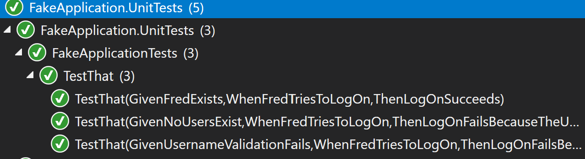

# GivenWhenThen
An NUnit extension package for cleanly written tests.

## Motivation

Where I work there is a heavy focus on making tests as close to plain English as possible. The benefits of this are two fold:
1) Code is easier to maintain as a developer
2) Code is easier for less technical testers to evaluate whether there is sufficient coverage

This package extends NUnit by defining classes to enable a simpler workflow when writing tests under the "Given When Then" approach. This style of test writing is covered extensively elsewhere, but speaking generally the base concept is:
- Given an initial state
- When something happens
- Then the result is/these things happen

GivenWhenThen aims to make writing tests in this style as simple as:

```
[TestCaseSource(nameof(TestCases))]
public void TestThat(
    GivenWhenThenTestCase toRun)
{
    toRun.RunTestCase();
}

public static IEnumerable<GivenWhenThenTestCaseData> TestCases
{
    get
    {
        yield return GivenWhenThen.Create(
            Given.UsernameValidationFails,
            When.FredTriesToLogOn,
            Then.LogOnFailsBecauseTheUserIsNotValid);
        yield return GivenWhenThen.Create(
            Given.NoUsersExist,
            When.FredTriesToLogOn,
            Then.LogOnFailsBecauseTheUserDidNotExist);
        yield return GivenWhenThen.Create(
            Given.FredExists,
            When.FredTriesToLogOn,
            Then.LogOnSucceeds);
    }
}
```



## Using GivenWhenThen

### Given

GivenWhenThen relies heavily upon the concept of a TestState<T> object (where T is the type of the class under test). This object stores two things:
- The instance of the class under test
- Any state that wants to be shared between the Given & Then stages of running a test

As such, a "Given" method is responsible for creating a TestState object and populating it:

```
public static TestState<LogonManager> FredExists()
{
    return CreateTestState(
        database: DatabaseCreator.ContainsUser("Fred"));
}

private static TestState<LogonManager> CreateTestState(
    Mock<IDatabase> database = null,
    Mock<IUsernameValidator> usernameValidator = null)
{
    database ??= DatabaseCreator.EmptyDatabase();
    usernameValidator ??= UsernameValidatorCreator.AlwaysValid();

    var result = new TestState<LogonManager>();
    result.StoreDependency(DatabaseDependency, database);
    result.StoreDependency(ValidatorDependency, usernameValidator);

    result.TestObject = new LogonManager(
        database.Object,
        usernameValidator.Object);

    return result;
}
```

### When

A "When" method simply needs to call the method(s) on your test object and optionally return the results of the actions it took:

```
public static bool FredTriesToLogOn(LogonManager testObject)
{
    return testObject.TryLogon("Fred");
}
```

### Then

Finally, a "Then" method is responsible for calling the provided "when" action/function before asserting the action completed as expected

```
public static void LogOnSucceeds(
    TestState<LogonManager> testState,
    Func<bool> act)
{
    var result = act();
    Assert.IsTrue(result);
    AssertUsernameWasChecked(testState);
    AssertDatabaseWasChecked(testState);
}

private static void AssertUsernameWasChecked(
    TestState<LogonManager> testState)
{
    var dependency = testState.GetDependency<Mock<IUsernameValidator>>(ValidatorDependency);
    dependency.Verify(m => m.IsValid(It.IsAny<string>()), Times.Once);
}

private static void AssertDatabaseWasChecked(
    TestState<LogonManager> testState)
{
    var dependency = testState.GetDependency<Mock<IDatabase>>(DatabaseDependency);
    dependency.Verify(m => m.UserExists(It.IsAny<string>()), Times.Once);
}
```